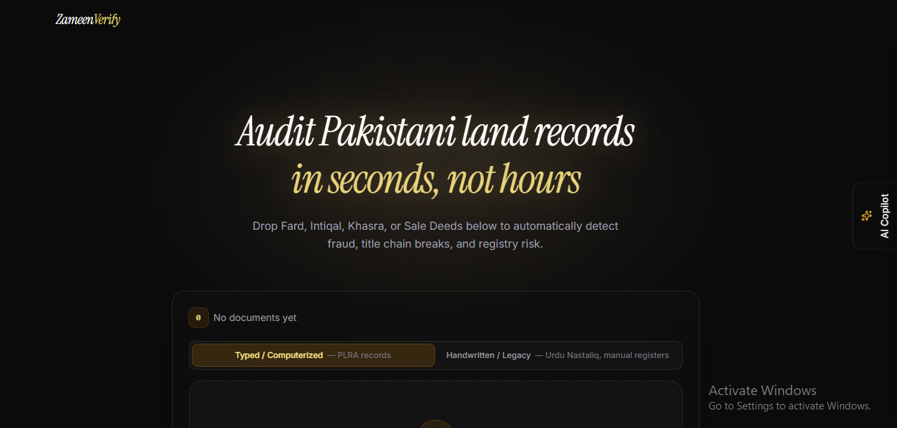

<div align="center">

# ZameenVerify

### Land fraud isn't rare in Pakistan. It's routine.

Fake Fards. Forged Intiqals. Sale deeds built on a title chain that quietly breaks
three owners back. Most buyers only find out after the money has moved.

**ZameenVerify reads the documents the way a good lawyer would — and flags what a buyer usually can't see.**

🏆 Built for the **Banoqabil AI Hackathon**, powered by Alibaba Cloud

<a href="https://zameenverify.vercel.app/">
  <strong>🌐 Try the live app →</strong>
</a>



</div>

---

## The problem

A land purchase in Pakistan runs through a stack of documents — **Fard**, **Intiqal**,
**Khasra**, **Sale Deed** — each produced at a different office, at a different time,
often by hand. A title is only as good as the *chain* connecting all of them.

Chains break quietly:
- A mutation (Intiqal) that was never properly recorded
- A khasra number that doesn't match across two documents
- A seller listed on the Fard who isn't the same person on the deed
- A legacy handwritten record with information a modern typed one contradicts

None of this looks wrong at a glance. It looks like paperwork. That's exactly why
it's easy to miss — and expensive when it's missed.

## What ZameenVerify does

```text
Land Records (PDF / JPG / PNG)
          ↓
   OCR + Document Parsing        →  handles both typed and legacy handwritten records
          ↓
   Structured Field Extraction   →  owner, khasra number, mutation history, dates
          ↓
   AI-Assisted Cross-Audit       →  checks the chain, not just the document
          ↓
   Verification Report           →  flagged risks, with a QR-verifiable record
```

- **Upload** multiple records — PDF, JPG, or PNG, typed or legacy handwritten
- **Extract** key fields automatically, even from inconsistent formats
- **Cross-check** the title chain for breaks, mismatches, and irregularities
- **Generate** a structured report you can act on — and verify independently later

## See it work — no documents needed

You don't need a real Fard to try this.

**[Download the sample documents](./demo)** and run them through the
**[live application](https://zameenverify.vercel.app/)** — see exactly what a flagged
inconsistency looks like before you ever upload anything of your own.

> ⚠️ **ZameenVerify is a due-diligence aid, not a legal authority.** It narrows down
> what to check — it doesn't replace it. Always confirm important findings against
> official land records before acting on them.

## Under the hood

| Layer | Stack |
|---|---|
| **Frontend** | Next.js · React · TypeScript · Tailwind CSS |
| **Backend** | Next.js API Routes · Supabase |
| **AI & Document Processing** | Qwen-Max (OCR + reasoning) · PDF processing · Sharp |
| **Other** | QR code generation · Framer Motion · Vercel Analytics |

Reports are QR-verifiable — each generated report can be independently checked on a
dedicated verification page, so a report can't quietly be edited after the fact.

## Why this matters

Land fraud isn't a technology problem at its root — it's an information asymmetry
problem. The person selling you land usually knows more about its history than you
ever will, and the records that would tell you otherwise are scattered across offices,
formats, and decades. ZameenVerify doesn't close that gap by being clever. It closes
it by actually reading everything, consistently, every time — which is the one thing
manual review under time pressure struggles to do.

## Limitations (read this before you rely on it)

- Extraction accuracy depends on scan/photo quality — heavily degraded legacy
  documents may need manual review
- ZameenVerify flags *inconsistencies*, not legal validity — a clean report is not a
  legal guarantee, and a flagged report is not proof of fraud
- Coverage is scoped to the document types listed above; it is not a substitute for
  a registrar or legal search

## Built with

ZameenVerify was built for the **Banoqabil AI Hackathon**, backed by **Alibaba Cloud**.
**Qwen-Max** powers the OCR and reasoning pipeline — extracting fields from both typed
and legacy handwritten records and auditing the title chain for inconsistencies.
**Claude** was used for code assistance throughout development.

---

<div align="center">

Built for buyers who'd rather find the problem before the money moves, not after.

</div>